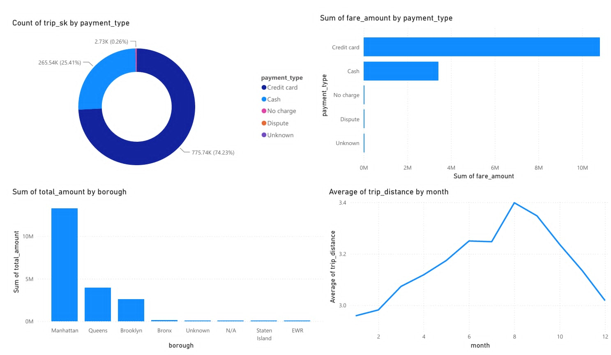
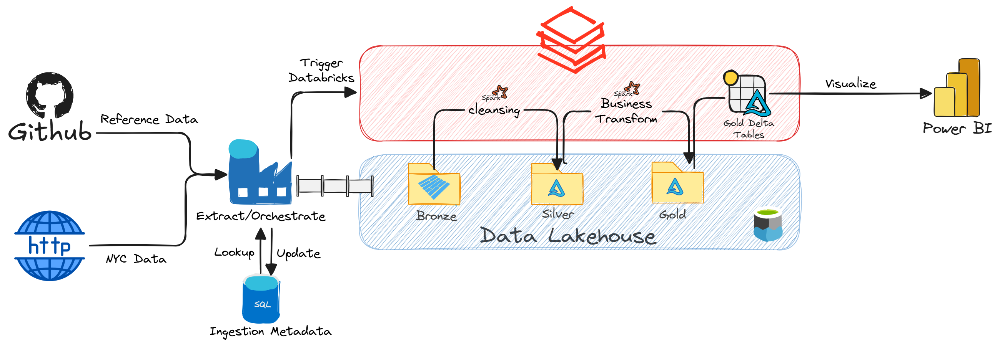
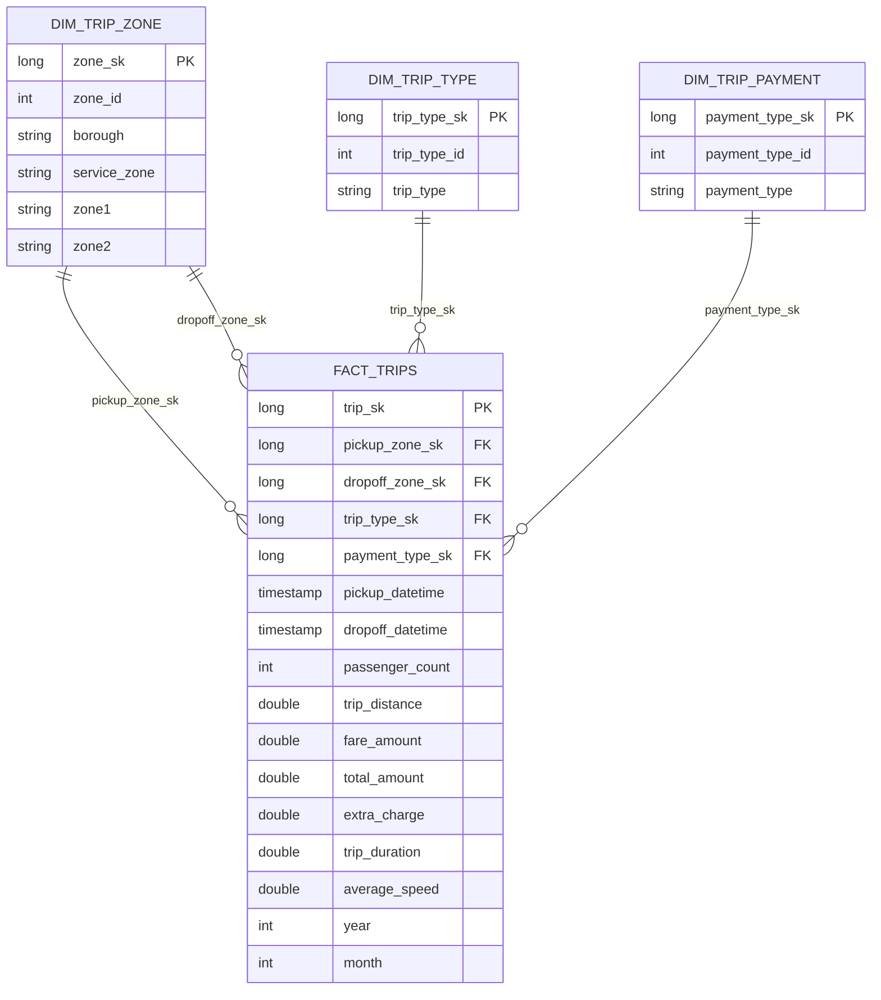

# **NYC Green Taxi Data Pipeline**

## **1. Overview**

This project implements an **end-to-end data lakehouse pipeline** for New York City Green Taxi trip data. Specifically, the pipeline follows the Medallion Architecture, consisting of Bronze, Silver, and Gold layers. Azure Data Factory is responsible for data ingestion and pipeline orchestration, while Azure Databricks and Apache Spark handle data transformation and data modeling. The final Gold layer provides business-ready datasets that are consumed by Power BI for analytics and visualization.

The project aims to answer the following business questions:

1. What payment method is most preferred by Green Taxi passengers?
2. Which payment method generates the highest fare revenue?
3. Which borough generates the highest total revenue?
4. How does the average trip distance vary by month?

The business questions are answered through the Power BI dashboard:



## **2. Architecture**



The project implements a **data lakehouse architecture** using Azure Data Lake Storage Gen2, Azure Data Factory, and Azure Databricks. The architecture follows the Medallion Architecture, separating data into three layers:

- **Bronze**: Stores raw taxi trip data ingested from the source with minimal transformation.
- **Silver**: Contains cleaned, validated, and standardized data.
- **Gold**: Contains business-ready dimensional and fact tables optimized for analytical workloads.

The pipeline follows an **ELT (Extract, Load, Transform)** process.

- Data is extracted from external sources and loaded into Azure Data Lake Storage Gen2 using Azure Data Factory
- Data transformation and modeling are then performed using Azure Databricks and Apache Spark. The final Gold tables are consumed by Power BI to generate business insights.

### **2.1 Azure Data Factory**

Azure Data Factory (ADF) is responsible for data ingestion and pipeline orchestration. ADF retrieves processing metadata from the Azure SQL Database using a Lookup activity. The metadata table determines which year/month partitions need to be processed using the dynamic parameters. This allows the pipeline to process multiple monthly partitions using a single reusable workflow.


### **2.2 Azure Data Lake Storage Gen2**

Azure Data Lake Storage Gen2 acts as the central storage layer of the architecture. Specifically, the data lake is organized using the Medallion Architecture:

```text
ADLS Gen2
│
├── Bronze
│   ├── green_taxi # the taxi data is partitioned by year/month inside this folder
|   ├── trip_zone
|   ├── trip_payement
|   └── trip_type
│
├── Silver
│   ├── green_taxi # the taxi data is partitioned by year/month inside this folder
|   ├── trip_zone
|   ├── trip_payement
|   └── trip_type
│   
└── Gold
    ├── fact_trips # the taxi data is partitioned by year/month inside this folder
    ├── dim_trip_zone
    ├── dim_trip_payement
    └── dim_trip_type
```
### **2.3 Azure Databricks**

Azure Databricks is responsible for data transformation and data modeling. Particularly, Apache Spark is used to process through layers:

#### **2.3.1 Silver layer**
- Cast data types and rename the attributes for readability.
- Clean data 
-  Feature engineering:
    - `trip_distance`: convert miles → km 
    - `trip_duration`: calculate trip duration (minutes)
    - `average_speed`: calculate average speed (km/h)
    - `extra_charge`: calculate extra charge = total_amount − fare_amount
- Handle outliers using IQR method to filter outliers across `trip_distance`, `trip_duration`, `average_speed` 

#### **2.3.2 Gold Layer**

- **Dimensions (SCD Type 1):** Create dimension tables, deduplicate natural keys, assign surrogate keys, and use `MERGE (UPSERT)` to update current values without maintaining history.
- **Fact Table:** Create `fact_trips` partitioned by `(year, month)`, join Silver data with dimension tables to retrieve surrogate keys, assign `trip_sk`, and store required measures.


### **2.4 Azure SQL Database**

Azure SQL Database is used to store pipeline control metadata. The control table contains the year/month partitions that should be processed. Azure Data Factory retrieves these records using a Lookup activity and passes the corresponding values to the pipeline as dynamic parameters. 

This metadata-driven approach allows the pipeline to process multiple monthly partitions using a single reusable workflow.


## **3. Technology Stack**

| Technology | Purpose |
|---|---|
| Azure Data Factory | Data ingestion and pipeline orchestration |
| Azure Data Lake Storage Gen2 | Data lake storage |
| Azure Databricks | Data transformation and processing |
| Apache Spark | Distributed data processing |
| Delta Lake | Storage format for Silver and Gold layers |
| Azure SQL Database | Metadata and reference data storage |
| Power BI | Data visualization and business analytics |

## **4. Data Modelling**

The Gold layer uses a star schema. `gold.fact_trips` is the central fact table and the three dimension tables provide descriptive attributes for payment, trip type, and taxi zones.



### **4.1. Fact Table: `fact_trips`**

This table contains the core transactional data and measurable metrics for individual taxi trips.

| **Column Name** | **Data Type** | **Key** | **Description** |
|---|---|---|---|
| `trip_sk` | LONG | PK | Surrogate key uniquely identifying each taxi trip. |
| `pickup_zone_sk` | LONG | FK | Foreign key referencing `dim_trip_zone(zone_sk)` representing the pickup location. |
| `dropoff_zone_sk` | LONG | FK | Foreign key referencing `dim_trip_zone(zone_sk)` representing the drop-off location. |
| `trip_type_sk` | LONG | FK | Foreign key referencing `dim_trip_type(trip_type_sk)` representing the type of taxi trip. |
| `payment_type_sk` | LONG | FK | Foreign key referencing `dim_trip_payment(payment_type_sk)` representing the payment method used for the trip. |
| `pickup_datetime` | TIMESTAMP | | The date and time when the trip started. |
| `dropoff_datetime` | TIMESTAMP | | The date and time when the trip ended. |
| `passenger_count` | INT | | The number of passengers in the vehicle. |
| `trip_distance` | DOUBLE | | The total distance traveled during the trip, measured in kilometers. |
| `fare_amount` | DOUBLE | | The base fare amount calculated for the trip. |
| `total_amount` | DOUBLE | | The total amount charged for the trip, including fares, surcharges, and other applicable charges. |
| `extra_charge` | DOUBLE | | Additional charges or surcharges applied to the trip. |
| `trip_duration` | DOUBLE | | The total duration of the trip. |
| `average_speed` | DOUBLE | | The calculated average speed of the vehicle during the trip. |
| `year` | INT | | The year extracted from the pickup datetime, used for partitioning and time-based analysis. |
| `month` | INT | | The month extracted from the pickup datetime, used for partitioning and time-based analysis. |

---

### **4.2. Dimension Table: `dim_trip_zone`**

This table contains descriptive information about taxi zones used to identify the pickup and drop-off locations of trips.

| **Column Name** | **Data Type** | **Key** | **Description** |
|---|---|---|---|
| `zone_sk` | LONG | PK | Surrogate key uniquely identifying each taxi zone. |
| `zone_id` | INT | | The original TLC taxi zone identifier. |
| `borough` | STRING | | The borough where the taxi zone is located, such as Manhattan, Brooklyn, Queens, or Bronx. |
| `service_zone` | STRING | | The service zone classification associated with the taxi zone. |
| `zone1` | STRING | | The primary name of the taxi zone. |
| `zone2` | STRING | | The secondary or descriptive name associated with the taxi zone. |

---

### **4.3. Dimension Table: `dim_trip_type`**

This table contains descriptive information about the types of taxi trips recorded in the dataset.

| **Column Name** | **Data Type** | **Key** | **Description** |
|---|---|---|---|
| `trip_type_sk` | LONG | PK | Surrogate key uniquely identifying each trip type. |
| `trip_type_id` | INT | | The original identifier representing the trip type. |
| `trip_type` | STRING | | The descriptive name of the trip type. |

---

### **4.4. Dimension Table: `dim_trip_payment`**

This table contains lookup information about the payment methods used for taxi trips.

| **Column Name** | **Data Type** | **Key** | **Description** |
|---|---|---|---|
| `payment_type_sk` | LONG | PK | Surrogate key uniquely identifying each payment method. |
| `payment_type_id` | INT | | The original identifier representing the payment method. |
| `payment_type` | STRING | | The descriptive name of the payment method, such as Credit Card, Cash, No Charge, or Dispute. |

## **5. Setup**

1. **Create Azure resources:** 
- ADLS Gen2 with hierarchical namespace and containers `bronze`, `silver`, `gold`
- Azure SQL Database
- Azure Data Factory
- Azure Databricks workspace.

2. **Create the SQL control table** in the database used by ADF:

Add one row per month to process. ADF reads rows where `enabled = 1` and disables them after the Bronze copy succeeds.

```sql
CREATE TABLE dbo.green_taxi_control (
    year VARCHAR(4) NOT NULL,
    month VARCHAR(2) NOT NULL,
    enabled BIT NOT NULL DEFAULT 1,
    CONSTRAINT PK_green_taxi_control PRIMARY KEY (year, month)
);

INSERT INTO dbo.green_taxi_control (year, month, enabled)
VALUES ('2024', '01'), ('2024', '02');
```

3. **Configure Databricks:** 
- upload `databricks/src/silver` and `databricks/src/gold` to `databricksBasePath`
- Create External Locations, granting the cluster read/write access to all three ADLS containers.
- Update the ADLS account name in the `SOURCE_PATH` and `TARGET_PATH` constants when necessary.

4. **Import and publish ADF:** 
- import the resources under `adf/`
- configure the linked services
- replace these pipeline parameters with environment values:

`adlsStorageUrl`, `sqlServer`, `sqlDatabase`, `sqlUserName`, `databricksDomain`, `databricksClusterId`, `databricksBasePath`.

Use Key Vault or managed identity for credentials, grant ADF access to ADLS/Databricks, then publish and trigger `pipeline`.


## **6. Repository Layout**

```text
nyc-green-taxi-data-pipeline/
├── README.md
├── LICENSE
├── adf/                                        # contains Azure Data Factory resources.
│   ├── publish_config.json
│   ├── factory/
│   │   └── nyc-taxi-adfs.json
│   ├── linkedService/
│   │   ├── datalakestorage.json
│   │   ├── lookup_data.json
│   │   ├── LS_AzureDatabricks.json
│   │   ├── nyc_data.json
│   │   └── nyc_metadata.json
│   ├── dataset/
│   │   ├── blob_storage_taxi_zone_lookup.json
│   │   ├── blob_storage_trip_payment.json
│   │   ├── blob_storage_trip_type.json
│   │   ├── blob_storage_trips.json
│   │   ├── green_taxi.json
│   │   ├── metadata.json
│   │   ├── taxi_zone_lookup.json
│   │   ├── trip_payment.json
│   │   ├── trip_type.json
│   │   └── trips.json
│   └── pipeline/
│       └── pipeline.json
├── databricks/                                
│   └── src/
│       ├── silver/                             # cleans and standardizes source data
│       │   ├── trip_payment.py
│       │   ├── trip_type.py
│       │   ├── trip_zone.py
│       │   └── trips.py
│       └── gold/                               # perform data modelling
│           ├── dim_payment.py
│           ├── dim_type.py
│           ├── dim_zone.py
│           └── fact_trips.py
├── documents/                                  # stores architecture and dashboard images
│   ├── adf.jpg
│   ├── architecture.png
│   └── dashboard.jpg
├── powerbi/
└── reference_data/                             # stores the lookup CSV files used by the pipeline
    ├── taxi_zone_lookup.csv
    ├── trip_payment.csv
    └── trip_type.csv
```


